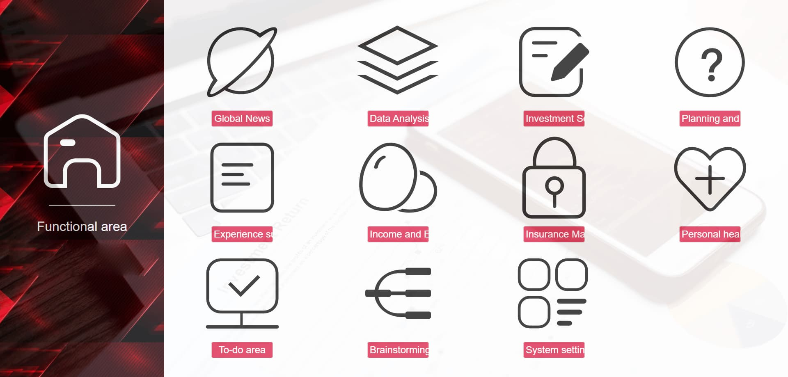

# Invest Smart System


Welcome to the Invest Smart System repository! This platform is designed to enhance your investment journey by providing a comprehensive suite of tools and resources. Whether you're a novice investor or a seasoned financial guru, this system is tailored to help you maximize your earnings.

### Features



- ***Investment News:*** Stay updated with the latest financial news that impacts your investments.
- ***Market Data Analysis:*** Dive into in-depth market analysis to make informed investment decisions.
- ***Invest Portfolio Management:*** Organize and manage your investment portfolio with ease.
- ***Investment Strategies:***  Explore proven strategies to optimize your investment portfolio.
- ***Balance Records:*** Keep track of your total money performance and progress.
- ***Insurance Management:*** Plan and manage your insurance needs to protect your investments.
- ***Personal Healthy:*** Monitor your health and well-being to ensure you're making the right investment decisions.
- ***Personalized Notes:*** Keep track of your investment ideas and market insights.
- ***Todo List:*** Stay on top of your investment goals and tasks.
- ***Brainstorming:*** Generate ideas and insights for your investments.
- ***System Config:*** Customize the system to suit your preferences and needs.

### Installation

To get started with the Invest Smart System, follow these simple steps:

1. Clone the repository to your local machine:
   ```
   git clone https://github.com/zhangboheng/invest-smart-system.git
   ```

2. Navigate to the project directory:
   ```
   cd invest-smart-system
   ```

3. Install the required dependencies:
   ```
   npm install
   ```

4. Run the application:
   ```
   npm run dev
   ```

### Database

The Invest Smart System utilizes a MySQL database to store and manage user data, investment portfolios, and other relevant information. To set up the database, follow these steps:

1. Log in to MySQL
2. Create a new database:
   ```
   CREATE DATABASE moneyspeed;
   ```

3. Select the Database:
   ```
   USE moneyspeed;
   ```

4. Import the SQL File:Now, import the SQL file from the directory where it is located. You can do this using the following command from the terminal (not inside MySQL):
   ```
   mysql -u root -p moneyspeed < path_to_your_sql_file.sql
   ```
   Replace `path_to_your_sql_file.sql` with the actual path to the SQL file you want to import.

I have provided the SQL file in the `sql` folder of the project. You can import it using the command mentioned above or use the MySQL Workbench to import the SQL file directly.


### Usage

Once the system is installed and the database is set up, you can start using the Invest Smart System. The platform provides a user-friendly interface that allows you to access various features and tools to enhance your investment journey.

### Tips

- Investment news can set rules, supports API, DOM and RSS, all configured by yourself. I also provided a browser extension to help you collect investment news. Please see the [LuckyNews Box](https://github.com/zhangboheng/LuckyNews-Box)
- Default Account:admin, Password:123456

### Contributing

We welcome contributions to the Invest Smart System. If you have any suggestions, bug reports, or feature requests, please open an issue or submit a pull request.

### License

This project is licensed under the MIT License - see the [LICENSE](./LICENSE) file for details.
